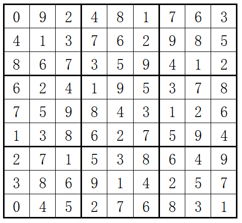
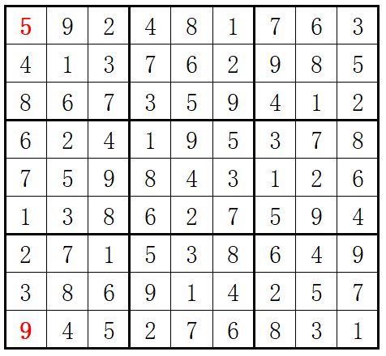

# HJ44 Sudoku
困难  通过率：30.77%  时间限制：1秒  空间限制：32M
# 知识点
- 思维
- 基础数学
- 搜索
# 描述
## 问题描述：
数独（Sudoku）是一款大众喜爱的数字逻辑游戏。玩家需要根据9X9盘面上的已知数字，推算出所有剩余空格的数字，并且满足每一行、每一列、每一个3X3粗线宫内的数字均含1-9，并且不重复。
## 例如：
输入

输出


# 数据范围：输入一个 9*9 的矩阵
## 输入描述：
包含已知数字的9X9盘面数组[空缺位以数字0表示]

# 输出描述：
## 完整的9X9盘面数组

# 示例
## 输入
```
0 9 2 4 8 1 7 6 3
4 1 3 7 6 2 9 8 5
8 6 7 3 5 9 4 1 2
6 2 4 1 9 5 3 7 8
7 5 9 8 4 3 1 2 6
1 3 8 6 2 7 5 9 4
2 7 1 5 3 8 6 4 9
3 8 6 9 1 4 2 5 7
0 4 5 2 7 6 8 3 1
```

## 输出
```
5 9 2 4 8 1 7 6 3
4 1 3 7 6 2 9 8 5
8 6 7 3 5 9 4 1 2
6 2 4 1 9 5 3 7 8
7 5 9 8 4 3 1 2 6
1 3 8 6 2 7 5 9 4
2 7 1 5 3 8 6 4 9
3 8 6 9 1 4 2 5 7
9 4 5 2 7 6 8 3 1
```

# 解答
## 分析
- 遍历二维数组的每一个位置，当该位置为0时，分别寻找该位置所在行、列和子方块中未出现的数字集合A，B，C
- 当$A \cap B \cap C$为空集时，则没有解，返回错误
- 当$A \cap B \cap C$为单元素集合$\{x\}$时，则该位置放置x
- 当$A \cap B \cap C$为多元素集合W时，遍历集合W，将元素分别放置在该位置，并递归求解